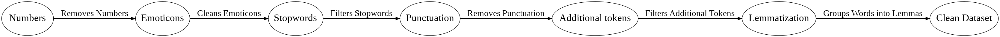
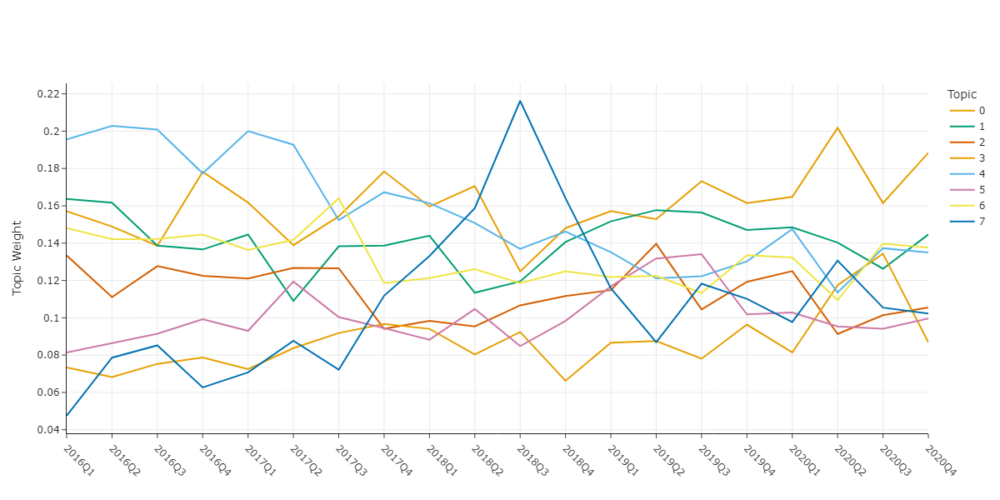
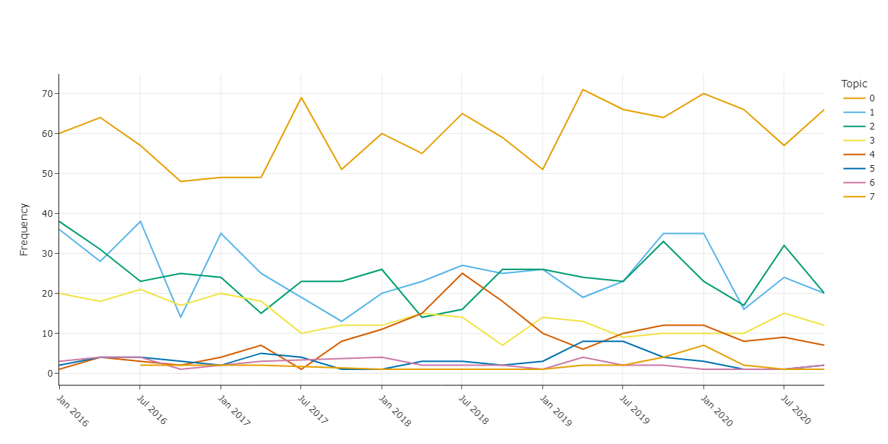

# Topic Modelling in Business Intelligence: BERTopic and FASTopic in Code

Python code for **Topic Modelling in Business Intelligence: BERTopic and FASTopic in Code**, submitted to *Towards Data Science (Medium)*. 
Article is [TBA]()

  
  
  

